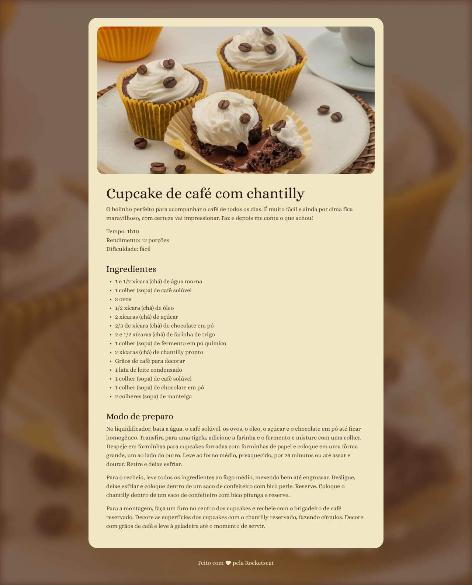

<h1 align="center"> Página de receitas </h1>

Uma página estática de uma receita de cupe cake desenvolvida para praticar e conceitos básicos sobre HTML e CSS

  <a href="#-tecnologias">Tecnologias</a>&nbsp;&nbsp;&nbsp;|&nbsp;&nbsp;&nbsp;
  <a href="#-projeto">Projeto</a>&nbsp;&nbsp;&nbsp;|&nbsp;&nbsp;&nbsp;
  <a href="#-layout">Layout</a>&nbsp;&nbsp;&nbsp;|&nbsp;&nbsp;&nbsp;

 

## 🚀 Tecnologias

Este projeto foi desenvolvido com as seguintes tecnologias:

  

## 💻 Projeto

Esta página web foi construíd em aulas práticas do curso de desenvolvimento web da [Rocketseat](https://app.rocketseat.com.br/?utm_source=google&utm_medium=cpc&utm_campaign=lead&utm_term=perpetuo&utm_content=institucional-lead-home-texto-lead-brandkws-none-none-institucional-none-none-br-google&type=ALL), na trilha de desenvolvimnto Fullstack.

## 🔖 Layout

  

Você pode visualizar o layout do projeto com mais detalhes através [DESSE LINK](https://www.figma.com/design/s0dmDGd6lAsrjeey6bWE1w/P%C3%A1gina-de-receita-(Community)?node-id=0-1&p=f&t=Cn4Lb9oAbTThoNL7-0). É necessário ter conta no [Figma](https://figma.com) para acessá-lo.

---

Feito com ♥ junto com a [Rocketseat](https://www.rocketseat.com.br)
